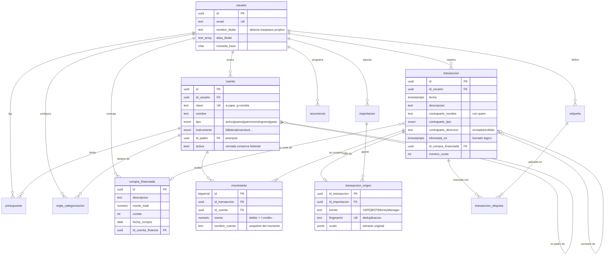

# Modelo de datos explicado

Acompaña a [`06-esquema-base-datos.sql`](06-esquema-base-datos.sql). Aquí está
el **porqué** de cada tabla y cada columna, para que nadie tenga que adivinar
la intención al leer el DDL.

---

## Idea central: partida doble

Una app de gastos normal guarda una fila por movimiento: *"gasté 44 en
comida"*. Balance guarda un **asiento** con dos o más movimientos que **suman
cero**:

```
Almuerzo con Diana — S/ 44
  ├── Comida    +44.00   (el gasto sube)
  └── YAPE      −44.00   (la cuenta baja)
                 ─────
                  0.00   ← si no da cero, no se guarda
```

Parece trabajo extra. Lo que compra: **los errores se vuelven visibles**. En
la migración real había 9 transacciones de S/1,910 que el sistema contaba como
ingreso siendo traspasos entre cuentas del propio titular. Con partida simple
ese error es invisible; con partida doble, el balance no cuadra y salta.

El invariante no es documental: lo impone un trigger (§ `movimiento`).

---

## Diagrama



---

## Las tablas, una por una

### `usuario`

Quién es el dueño de los datos. Toda tabla cuelga de aquí porque el diseño
contempla multiusuario desde el principio: añadirlo después obliga a migrar
todas las claves.

| Columna | Para qué existe |
|---|---|
| `nombre_titular` | **No es decorativo.** Es lo que distingue un traspaso entre cuentas propias de un ingreso real. Sin él, mover dinero de tu PLIN a tu YAPE se cuenta como ingreso e infla el total un 25%. |
| `alias_titular` | El mismo titular aparece escrito de formas distintas según el banco: `Jeferson Buj*`, `PLIN - Jeferson fredy Bujaico Rodriguez`, `JEFERSON FREDY BUJAICO RODRIGUEZ`. |
| `moneda_base` | Moneda en la que se consolidan los informes. Preparado para multimoneda sin implementarla aún. |

---

### `cuenta`

El plan contable: dónde está el dinero **y** cómo se clasifica el gasto. En
partida doble ambas cosas son cuentas; solo cambia el tipo.

| Columna | Para qué existe |
|---|---|
| `clave` | Identificador legible y estable (`a-yape`, `g-comida`). Permite que los importadores y los datos semilla referencien cuentas **sin conocer el UUID**. Es lo que hace portable el volcado SQL. |
| `tipo` | Naturaleza contable. Decide el signo con el que crece la cuenta: `activo` y `gasto` por débito (+), el resto por crédito (−). |
| `instrumento` | **Dimensión ortogonal al tipo.** `YAPE` y `Tyba` son ambos `activo`, pero uno es dinero disponible hoy y el otro está invertido. Sin esta columna no se puede responder *"¿cuánto tengo disponible?"*. |
| `id_padre` | Jerarquía de profundidad libre: `Renta` cuelga de `Vivienda`. Los informes agrupan por la raíz para no producir un donut de 12 porciones. |
| `activa` | **Cerrar, no borrar.** Una tarjeta que ya no tienes conserva su historial pero desaparece de los selectores. Borrarla dejaría movimientos apuntando a la nada y descuadraría el balance. |

Restricción `instrumento_solo_en_cuentas_de_dinero`: un instrumento solo tiene
sentido donde vive el dinero. Una categoría de gasto no es un banco.

**Por qué el tipo se deduce del instrumento:** en la interfaz eliges "Tarjeta
de crédito" y la cuenta va a `pasivo` automáticamente. El usuario no tiene por
qué saber contabilidad para no equivocarse.

---

### `transaccion`

La cabecera del asiento: cuándo, qué y con quién. **No lleva importe** — el
importe vive en los movimientos. Es el detalle que más confunde al llegar de
un modelo de partida simple, y también el que hace imposible descuadrar.

| Columna | Para qué existe |
|---|---|
| `contraparte_nombre` | Con quién se movió el dinero. **Campo propio, no una cuenta**: con ~66 contrapartes distintas (46 de una sola aparición) el plan de cuentas se volvería inmanejable. Responde *"¿cuánto le he enviado a Diana?"* sin ensuciar la contabilidad. |
| `contraparte_tipo` | `persona`, `servicio`, `comercio`, `propia`… Lo deduce el clasificador del formato del nombre. **`propia` es el crítico**: marca los traspasos entre cuentas del titular, que no son ingreso ni gasto. |
| `contraparte_direccion` | `enviado` / `recibido`. El extracto siempre da el monto en positivo; la dirección es la que pone el signo en pantalla. |
| `eliminada_en` | **Borrado lógico.** Nada se destruye: se marca. Un borrado accidental de 129 movimientos importados no puede ser irreversible. Todo cálculo filtra `WHERE eliminada_en IS NULL`. |
| `eliminada_motivo` | Agrupa la papelera en lotes (*"Limpieza de 2026"*) para poder restaurar en bloque, no de una en una. |
| `creado_por` | `manual` / `import` / `recurrencia` / `cuota`. Sin esto no se puede responder *"¿qué entró en la importación de ayer?"* ni deshacerla. |

---

### `movimiento`

Cada pata del asiento. Una transacción tiene 2 o más y **suman cero**.

| Columna | Para qué existe |
|---|---|
| `monto` | `NUMERIC(14,2)`, **nunca float**: en dinero, `0.1 + 0.2 != 0.3` es inaceptable. Convención interna que el usuario nunca ve: débito `+`, crédito `−`. |
| `nombre_cuenta` | **Snapshot del momento.** Si mañana renombras "Comida" a "Alimentación", el histórico recuerda cómo se llamaba entonces. El cálculo siempre usa `id_cuenta`; este texto es solo memoria. Copiado de Money Manager (`ASSET_NIC`, `CATEGORY_NAME`). |

**El trigger `trg_cuadre`** es el corazón del modelo:

```sql
CREATE CONSTRAINT TRIGGER trg_cuadre
    AFTER INSERT OR UPDATE OR DELETE ON movimiento
    DEFERRABLE INITIALLY DEFERRED
```

`DEFERRABLE INITIALLY DEFERRED` es deliberado: se comprueba **al COMMIT**, no
fila a fila. Sin eso sería imposible insertar un asiento, porque tras la
primera pata el saldo aún no es cero.

Sin este trigger la partida doble es una convención que el primer bug rompe en
silencio. Con él, un asiento descuadrado **no puede existir en la base**.

---

### `importacion` y `transaccion_origen`

Trazabilidad: de dónde salió cada dato.

| Columna | Para qué existe |
|---|---|
| `fingerprint` | Huella para deduplicar. **Comparar por monto y fecha no funciona** — se intentó y falló, porque una transacción guardada no tiene "monto", tiene movimientos. Consecuencia real: reimportar el mismo archivo duplicaba todo el historial. |
| `crudo` (JSONB) | El extracto tal cual llegó. Permite **re-derivar** categoría o contraparte cuando mejoren las reglas, sin volver a pedirle el archivo al usuario. |
| `id_importacion` | Agrupa por lote, que es lo que permite "deshacer esta importación". |

El índice único sobre `fingerprint` convierte la deduplicación en una garantía
de la base, no en una comprobación que alguien pueda olvidar.

---

### `compra_financiada`

En Perú una compra con tarjeta a 12 meses **no es un gasto de S/1,200 hoy**:
es una deuda que se paga en 12 tramos. Registrarla entera distorsiona el mes
de la compra y deja invisibles los 11 siguientes.

Cada cuota es una `transaccion` normal con `id_compra_financiada` y
`numero_cuota`. Así aparecen en el calendario y en los saldos por su fecha
real, sin necesitar una tabla aparte de vencimientos.

**Detalle del reparto:** con S/100 en 3 cuotas no salen 33.33 × 3 = 99.99. El
céntimo sobrante va en la última: `33.33 + 33.33 + 33.34 = 100.00`. Si no, la
deuda financiada no cuadraría con la compra.

`id_transaccion_origen_comision` liga el ITF al movimiento que lo generó.
Sumarlo al importe de la compra falsearía cuánto costó realmente lo comprado.

---

### `etiqueta` y `transaccion_etiqueta`

Clasificación **transversal**, que cruza categorías. "Viaje 2026" toca comida,
transporte y hotel a la vez — algo que la jerarquía de cuentas no puede
expresar porque cada movimiento cae en una sola categoría.

Relación N:N porque una transacción puede llevar varias etiquetas.

---

### `presupuesto`, `recurrencia`, `regla_categorizacion`

| Tabla | Para qué existe |
|---|---|
| `presupuesto` | Límite por categoría y periodo. El `UNIQUE` evita dos presupuestos para la misma categoría. |
| `recurrencia` | Plantilla de lo que se repite (alquiler, Netflix). `ultima_aplicada` evita generarla dos veces el mismo mes. |
| `regla_categorizacion` | **Que el sistema aprenda.** Hoy adivina por palabras clave; esta tabla permite que el usuario corrija y que la corrección persista. `prioridad` resuelve reglas en conflicto. Es el patrón de Firefly III: reglas explícitas que el usuario ve y edita, antes que un modelo opaco. |

---

## Las vistas

No son adorno: encapsulan reglas que si se repiten en el código acaban
divergiendo.

| Vista | Qué resuelve |
|---|---|
| `v_saldo_cuenta` | El signo mostrado según el lado normal de la cuenta. Repetir ese `CASE` en cada consulta es garantía de que en algún sitio salga invertido. |
| `v_liquidez` | Separa **disponible** de **invertido** usando `instrumento`. No es lo mismo tener S/2,000 en YAPE que en Tyba. |
| `v_flujo_mensual` | Ingresos y gastos por periodo. `date_trunc` admite `day`, `week`, `month`, `year`: los mismos periodos que ofrece el dashboard. |
| `v_contrapartes` | Con quién mueves dinero. **Excluye `tipo = 'propia'`**: contar los traspasos propios infló los totales un 25% en los datos reales. |

---

## Cómo se conectan al importar

Recorrido completo de un movimiento desde el extracto hasta la base:

```
1. parseYAPE / parseBCP / parseMoneyManager
   → lee el archivo, produce una transacción cruda con fingerprint

2. deduplicator
   → ¿ese fingerprint ya está en transaccion_origen?
     · sí, y viene del historial   → descartar
     · sí, dentro del mismo archivo → descartar solo las posteriores
     · no                           → sigue

3. clasificador
   → ¿quién es la contraparte? persona / servicio / comercio / PROPIA
     usa usuario.nombre_titular para detectar los traspasos propios

4. categorizador
   → ¿en qué cuenta de gasto cae? la institución detectada manda sobre
     las palabras clave

5. motor/asientos
   → arma los movimientos:
     · contraparte propia → transferencia entre dos cuentas de activo
     · gasto              → categoría + / cuenta de fondos −
     · ingreso            → cuenta de fondos + / categoría −

6. INSERT
   transaccion → movimiento (×2) → transaccion_origen
   El trigger comprueba el cuadre al COMMIT.
```

**Orden que importa:** "es un servicio" se comprueba **antes** que "es el
titular". Pagar el propio recibo de Entel figura a tu nombre pero es un gasto,
no un traspaso. Al revés se perdían S/222.70 en 3 transacciones.

---

## Migración desde localStorage

```bash
node scripts/exportar-a-sql.mjs > balance.sql
psql -d balance -f docs/06-esquema-base-datos.sql
psql -d balance -f balance.sql
```

Comprobación obligatoria después de cargar — **debe devolver 0 filas**:

```sql
SELECT id_transaccion, SUM(monto)
FROM movimiento
GROUP BY id_transaccion
HAVING ABS(SUM(monto)) > 0.005;
```

Si devuelve algo, hay asientos descuadrados y los saldos mienten.
